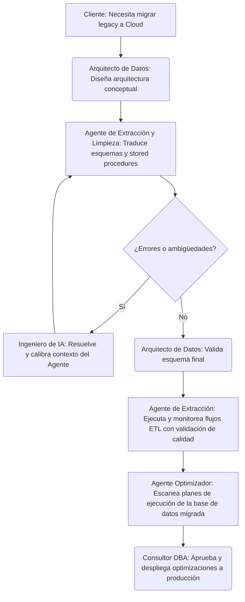

# Definición de Agentes y Roles: Toro Data SpA

Este documento establece las bases operativas de **Toro Data SpA**, una consultora chilena de tecnología e informática especializada en bases de datos e inteligencia artificial aplicada. Nuestro modelo de trabajo es **híbrido**, integrando el talento y criterio estratégico humano con la automatización inteligente y autonomía de agentes de IA para entregar soluciones de datos de nivel empresarial.

---

## 1. Visión General del Modelo Híbrido

Para ofrecer servicios de alta fidelidad, velocidad y precisión a nuestros clientes corporativos, estructuramos la consultora en un esquema de **colaboración Humano-IA**. 

* **Humanos:** Aportan el criterio estratégico, la empatía con el cliente, el diseño de arquitectura a alto nivel, la validación ética y la supervisión técnica final (*Human-in-the-Loop*).
* **Agentes de IA:** Automatizan tareas complejas y repetitivas, analizan patrones a gran escala, generan código SQL/ETL inicial, y optimizan bases de datos de forma continua y proactiva.

---

## 2. Roles Humanos (Talento Estratégico)

Definimos cuatro roles clave responsables del diseño de soluciones, la entrega al cliente y el entrenamiento de los modelos de IA.

### A. Arquitecto de Datos
* **Objetivo:** Diseñar arquitecturas de datos robustas, escalables y seguras, alineadas con las necesidades de negocio del cliente.
* **Responsabilidades:**
  * Liderar el descubrimiento inicial con clientes de FinTech, Retail y Salud en Chile.
  * Definir el modelo conceptual y lógico de datos (on-premise o cloud).
  * Validar las propuestas de diseño y migración generadas por los agentes de IA.
  * Asegurar el cumplimiento de normativas internacionales y locales de privacidad de datos.
* **Tecnologías Clave:** Snowflake, BigQuery, PostgreSQL, AWS, GCP, Azure.
* **Interacción con IA:** Colabora con el **Agente de Extracción y Limpieza de Datos** para validar las estructuras de destino post-migración.

### B. Consultor DBA
* **Objetivo:** Garantizar la velocidad de respuesta de las bases de datos, la inmunidad del sistema ante vulnerabilidades y la continuidad operacional.
* **Responsabilidades:**
  * Realizar auditorías de rendimiento y configurar esquemas de indexación y particionamiento.
  * Diseñar políticas de encriptación de datos sensibles y control de accesos.
  * Analizar planes de ejecución complejos y supervisar la optimización de base de datos.
* **Tecnologías Clave:** PostgreSQL, MongoDB Atlas Security, pgtune, herramientas de monitoreo APM.
* **Interacción con IA:** Trabaja en sinergia directa con el **Agente Optimizador de Queries**, analizando sus reportes de cuellos de botella y autorizando scripts de optimización en producción.

### C. Ingeniero de IA
* **Objetivo:** Implementar modelos predictivos, agentes autónomos y flujos de procesamiento inteligente de datos.
* **Responsabilidades:**
  * Desarrollar, calibrar y hacer fine-tuning de modelos LLM especializados en generación de SQL y datos estructurados.
  * Diseñar la lógica de los agentes autónomos utilizando frameworks de desarrollo de IA.
  * Asegurar la robustez y calidad en la integración de APIs de LLMs con los sistemas transaccionales del cliente.
* **Tecnologías Clave:** LangChain, OpenAI API, Python, PyTorch/TensorFlow, dbt.
* **Interacción con IA:** Configura, calibra y entrena a todos los **Agentes de IA** de Toro Data SpA, actuando como su administrador y supervisor técnico.

### D. Analista de Negocio (Business Analyst)
* **Objetivo:** Traducir los datos técnicos en insights y valor comercial directo para la toma de decisiones empresariales.
* **Responsabilidades:**
  * Reunirse con los stakeholders del cliente para entender los KPIs críticos de negocio.
  * Diseñar la lógica de negocio detrás de los reportes y modelos de forecasting.
  * Validar que los entregables analíticos respondan a las problemáticas reales de la industria del cliente.
* **Tecnologías Clave:** PowerBI, Tableau, SQL, dbt, herramientas de analítica predictiva.
* **Interacción con IA:** Supervisa y retroalimenta al **Agente de Reportería Automática**, validando y enriqueciendo los borradores de dashboards y reportes ejecutivos generados.

---

## 3. Agentes de IA (Automatización y Escala)

Nuestros agentes de IA son sistemas de software autónomos que interactúan directamente con los datos, el código y las API bajo parámetros de control y seguridad definidos.

### A. Agente Optimizador de Queries (Query Optimizer Agent)
* **Objetivo:** Monitorear y mejorar de manera proactiva la salud y velocidad de las bases de datos de los clientes.
* **Responsabilidades:**
  * Escanear planes de ejecución de consultas lentas en PostgreSQL o MongoDB.
  * Proponer índices óptimos, reescritura de consultas SQL y mejoras de diseño lógico.
  * Simular el impacto de los cambios propuestos en un sandbox aislado.
* **Tecnologías:** Modelos especializados en optimización de SQL, parsers de planes de ejecución, python-pg-query.
* **Mecanismo de Control:** No realiza cambios directos sobre bases de datos de producción; genera propuestas en un sandbox que el **Consultor DBA** humano debe validar y autorizar.

### B. Agente de Extracción y Limpieza de Datos (Data ETL & Cleaning Agent)
* **Objetivo:** Automatizar la ingesta, normalización y migración de datos de esquemas heredados hacia plataformas modernas.
* **Responsabilidades:**
  * Traducir lógica legacy (stored procedures en dialectos antiguos) a SQL optimizado para BigQuery/Snowflake.
  * Detectar anomalías en la calidad de los datos entrantes (nulos atípicos, inconsistencias de formato).
  * Auto-reparar fallas menores en flujos ETL (ej. reintentos inteligentes, adaptación a pequeños cambios en APIs de origen).
* **Tecnologías:** LangChain, SQLGlot, Great Expectations para monitoreo de calidad de datos.
* **Mecanismo de Control:** Detiene el flujo de migración/ETL y notifica al **Ingeniero de IA** y al **Arquitecto de Datos** si la calidad de los datos cae por debajo del 95% de confianza.

### C. Agente de Reportería Automática (Auto-Reporting Agent)
* **Objetivo:** Generar insights analíticos iniciales y borradores de informes de forecasting a partir de datos corporativos.
* **Responsabilidades:**
  * Conectarse a Snowflake o BigQuery y ejecutar consultas analíticas complejas mediante Text-to-SQL.
  * Ejecutar algoritmos de forecasting sobre series de tiempo de negocio (ventas, stock, rotación de clientes).
  * Generar reportes ejecutivos en formato Markdown/PDF con visualizaciones clave.
* **Tecnologías:** LangChain SQL Agent, API de OpenAI, modelos de forecasting estadísticos y de deep learning.
* **Mecanismo de Control:** Todo informe es enviado como borrador al **Analista de Negocio** humano para su corrección de estilo, contexto e interpretación comercial antes de la entrega final.

---

## 4. Flujo de Trabajo Híbrido en un Proyecto Típico

Para ilustrar cómo colaboran los humanos y los agentes de IA en Toro Data SpA, se presenta el ciclo de un proyecto de migración y optimización:

---

## 5. Segmentos de Clientes e Impacto (Mercado Chileno)

Nuestra metodología híbrida se adapta de manera precisa a los desafíos de nuestros sectores objetivo:

| Sector | Problema Común | Solución Híbrida Aplicada |
| :--- | :--- | :--- |
| **FinTech** | Altos estándares de seguridad, transaccionalidad masiva y regulaciones (ej. CMF en Chile). | **Agente Optimizador de Queries** + **Consultor DBA** asegurando rendimiento óptimo y control estricto de accesos sobre PostgreSQL/Snowflake. |
| **Retail** | Datos fragmentados de e-commerce y tiendas físicas, necesidad de proyectar stock. | **Agente de Reportería Automática** + **Analista de Negocio** entregando forecasting de demanda sobre BigQuery. |
| **Salud** | Sistemas de fichas clínicas desconectados, estricto cumplimiento legal. | **Agente de Extracción y Limpieza** normalizando datos + **Arquitecto de Datos** garantizando compliance y anonimización de PII. |
| **Startups en Escala** | Crecimiento acelerado con deuda técnica de datos desde el inicio. | **Agente de Extracción** + **Arquitecto de Datos** estructurando data warehouses y data lakes escalables y limpios desde el día uno. |
